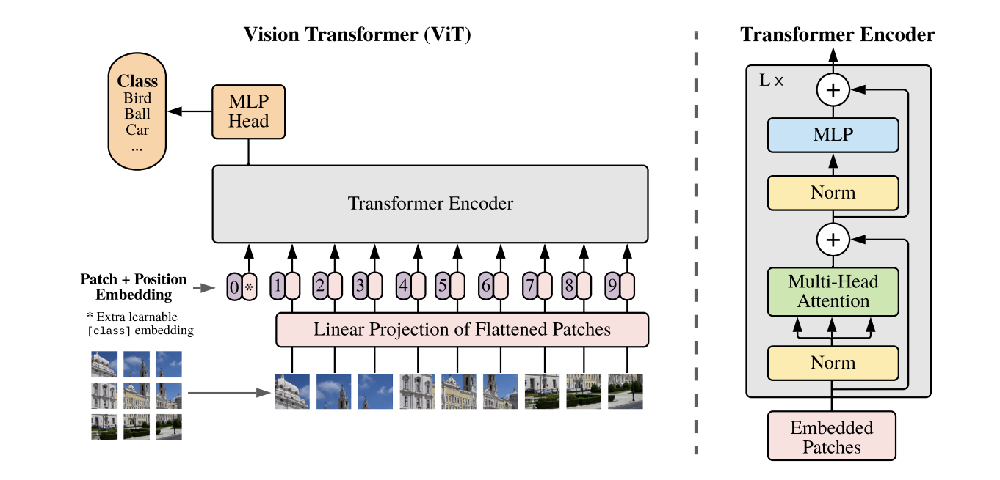
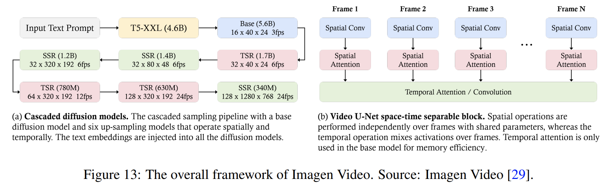

# Presumed Architecture
How do the experts think the SORA works?

---

#### Video Compression
> An encoder aims aiming to reduce the dimensionality of input data and output a latent representation that is compressed both temporally and spatially.

---

#### Variational Autoencoder

<!-- Sora’s team is expected to train their own compression network with a
decoder (the video generator) from scratch via the manner employed in training latent diffusion models – since this method primarily focuses on spatial patch compression, it necessitates an additional mechanism for aggregating temporal information within the model -->

---

Regular Autoencoder | Variational Autoencoder
-----|:-----:|
 | 

--- 

#### Vision Transformers
<!--  -->

> The U-ViT architecture for diffusion models, which is characterized by treating all inputs including the time, condition and noisy image patches as tokens and employing skip connections known from U-Net.

---

---

#### Imagen Video Framework

Allows the system to focus computational resources on producing fine details only where needed, rather than generating high-resolution outputs in a single, computationally expensive pass.

<!-- 
SSR = spatial super-resolution
TSR = temporal super-resolution
-->

---

---

# Latent Diffusion Models
1. Convert input into latent representation
2. Perform diffusion
3. Convert back to the regular representation

---

---

---

---

# Prompt Engineering
How do we talk with SORA?

---

---

---

---

# Alignment and Learning with Human Feedback

---

# Final Remarks

---

# Sources
- [SORA](https://arxiv.org/pdf/2402.17177)
- [U-Vit](https://arxiv.org/pdf/2209.12152)
- [Imagen Video](https://arxiv.org/pdf/2210.02303)
- [Latent Diffusion Models](https://arxiv.org/pdf/2304.08818)

---

# End
