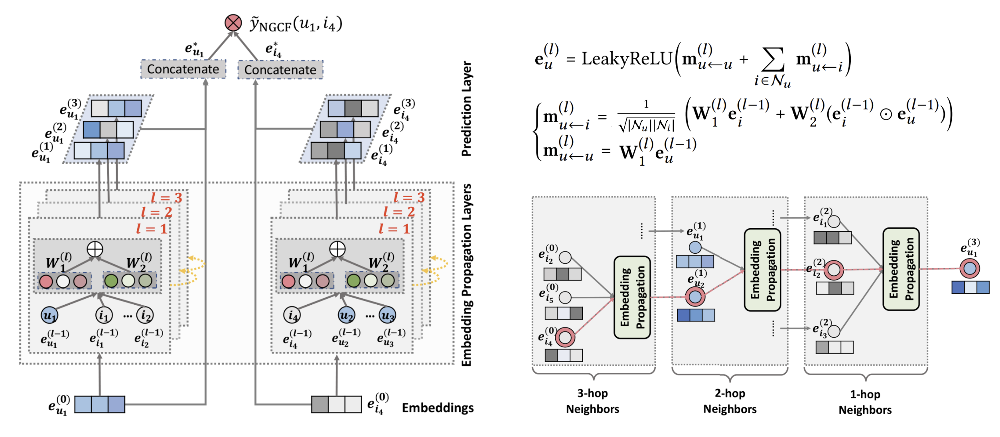

### Graph Convolutional Networks (GCN)

---
### Graph Convolutions

---
### Embeddings

Note that stacking more layers means that information from a given node is able to reach nodes farther away from that node, enabling us to capture the higher-order graph structure.

---
### Connectivity

An illustration of the user-item interaction graph and the high-order connectivity. The node u1 is the target user to provide recommendations for. 

<!-- For example, the path u1 ← i2 ← u2 indicates the behavior
similarity between u1 and u2, as both users have interacted with
i2; the longer path u1 ← i2 ← u2 ← i4 suggests that u1 is likely to
adopti4, since her similar useru2 has consumed i4 before. Moreover,
from the holistic view of l = 3, item i4 is more likely to be of interest
to u1 than item i5, since there are two paths connecting <i4,u1>,
while only one path connects <i5,u1> -->

---
### Neural Graph Collaborative Filtering (NGCF)
<!-- inspired by the tree connectivity expansion -->

---
### Computation

---
### Optimization

(during training randomly sample a batch of triplets)

---
### Learned representation t-SNE

---
### Performance measure

---
### Simplifying NGCF
It is argued that eliminating feature extraction is justified, as applying stacked nonlinearities to a structureless input (such as IDs) fails to generate meaningful features and hampers training efficiency.

- **NGCF-f** removes the feature transformation matrices W
- **NGCF-n** removes non-linearity σ
- **NGCF-fn** combines the above

---
### LightGCN (LCN)

---

---
<!-- # Colored word -->
### Performance comparison

---
# Main LightGCN Properties

---
### Relation to SimpleGCN
- **LightGCN**

- **SimpleGCN**

The above derivation shows that, inserting self-connection into A
and propagating embeddings on it, is essentially equivalent to a
weighted sum of the embeddings propagated at each LGC layer.

---
### Relation to APPNP
- **LightGCN**

- **APPNP**

We see that by setting α accordingly, LightGCN can fully recover the prediction embedding used by APPNP. As such, LightGCN shares the strength of APPNP in combating oversmoothing.

---
# Final remarks on LGC
- Simple to train and implement
- Better generalization ability
- Performance efficient
- Potentially resilient to oversmoothing

---
# End
