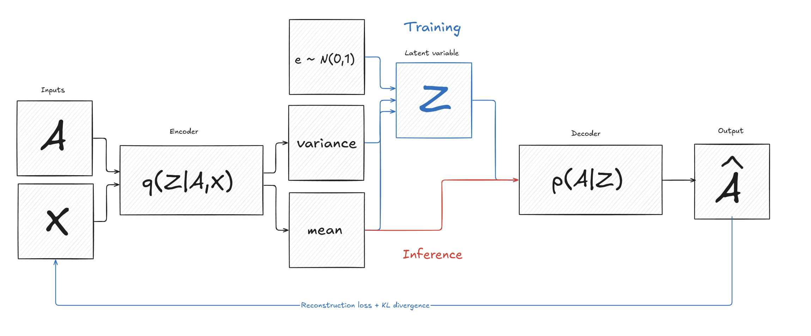

# Link Prediction

---

# Link prediction methods

---

- **Friend Suggestions**
Predicts potential connections based on mutual friends and shared interests.
- **Fraud Detection**
Identifies suspicious patterns, such as clusters of fake profiles
that attempt to connect to real users.

---

- **Product Recommendations**
Suggests items based on previous purchases and browsing history.
- **Personalized Experience**
Enhances user engagement by predicting relevant content.

---

- **Protein Interactions**
Predicts potential interactions between proteins, aiding in functional discovery.
- **Genetic Disease Understanding**
Assists in understanding genetic diseases by predicting gene-gene interactions.

---

# Traditional Methods
<!-- In order to better understand the role of GNNs let us first examine the traditional approaches to the link prediction problem. -->

---

<!-- We will explore the three most prominent categories -->
##  Categories of link prediction methods

- **Heuristic methods**
	use simple node similarity scores as the likelihood of links

- **Embedding (latent-feature) methods**
	produce latent representations of nodes using a variety of optimization algorithms

- **Content-based methods**
	use node-only features, disregarding the graph structure

---

## Local heuristics
This class of heuristics considers only the local subgraphs of the nodes in question.

Here $\Gamma(x)$ denotes the neighbours of x.

---

## Global Heuristics
These heuristics, also known as high order heuristics, make their judgement based on the entire network.

---

<!--  -->
# Rooted PageRank
Let $\pi_x$ be a stationary distribution representing the long-term behavior of a random walker on a graph that following a set of rules:

- move to one of its neighboring nodes with probability $\alpha$ 
- return to $x$ with probability $1-\alpha$ 

Therefore, $[\pi_x]_y$ essentially estimates how likely it is to reach node $y$ from node $x$, which can be interpreted as the strength or likelihood of a connection (link) from $x$ to $y$.

---

### Heuristic limitations

- Most heuristics only work for homogeneous graphs
- Work well only when the network formation aligns with the heuristic
- They only capture a small subset of all possible structure patterns

---

## Embedding methods
The second class of traditional link prediction methods, known as embedding methods (or latent-feature methods), compute hidden node representations. These features, derived from network structures like adjacency or Laplacian matrices, are not directly interpretable.

---

# Matrix Factorization
Matrix factorization decomposes the observed adjacency matrix $A$ into the product of a low-rank latent-embedding matrix $Z$ and its transpose, allowing for the edges reconstruction:

The latent embeddings are learned by minimizing the mean-squared error between the reconstructed and true adjacency matrices:

<!-- Variants of matrix factorization include using powers of A -->
<!-- One can also use other node similarity matrices to A -->

---

### DeepWalk

---

### Comparison?

---

### Content-based methods
> Content-based methods leverage explicit content features associated with nodes for link prediction (...) However, they usually have worse performance than heuristic and latent-feature methods (...) Thus, they are usually used together with the other two types of methods.

---

# GNN Methods
Can graph neural network compete with the other methods?

---

##  Link prediction paradigms

- **Node-based**
	aggregate the pairwise node representations learned by a GNN as the link representation

- **Subgraph-based**
	extract a local subgraph around each link and use the subgraph representation learned by a GNN as the link representation.

---

# Graph Convolutional Network (GCN)

The convolution is neighbourhood aggregation and resembles that of the regular convolutional networks if we think of the closest pixels as a neighbourhood subgraph.

---

# Graph AutoEncoder (GAE)
<!-- Let us consider Graph AutoEncoder (GAE) based on a Graph Convolutional Network (GCN). -->

Such node-based model is trained to minimize the binary cross entropy between the true adjacency matrix and its reconstruction.

- Identity matrix may be substituted for X should there be no node feature data to consider.
- The probability of there being a link is defined as a sigmoid of the similarity between the representations of the two considered nodes with respect to their dot product.
- In practice, the loss from existing edges is usually upscaled by the ratio between the existing and missing edges to balance out the data.

---

# Variational AutoEncoders (VAEs)
Variational AutoEncoders are a bayesian inference approach to data generation. We presuppose the existance of a some hidden variable $z$ which generates an observation $x$ and we would like to compute $p(z|x)$.

This is troublesome to compute and so we approximate the $p(z|x)$ with $q(z|x)$ and minimize

---

---

---

# Variational Graph AutoEncoder (VGAE)

Just like in GAE a GCN encoder and a simple dot product decoder are proposed.

---

# SEAAAL

---

# End
